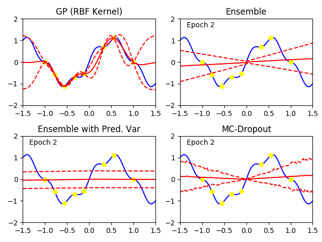

# nns-as-gps
Comparison of neural network ensembles and Monte Carlo dropout in their ability to mimic the behavior of a Gaussian process.

The ensemble methods implemented are:
1. A vanilla ensemble of neural networks, each predicting a single value, and trained using MSE loss.
2. An ensemble of neural networks that each predict a mean and variance, trained with NLL loss, as advised by this [paper](https://arxiv.org/pdf/1612.01474v1.pdf).
3. Monte-Carlo dropout, as described in this [paper](https://arxiv.org/pdf/1506.02142.pdf)

See also:
1. Another implementation of ensembles with predictive uncertainty [here](https://github.com/vvanirudh/deep-ensembles-uncertainty)

**Author** : Kunal Menda
